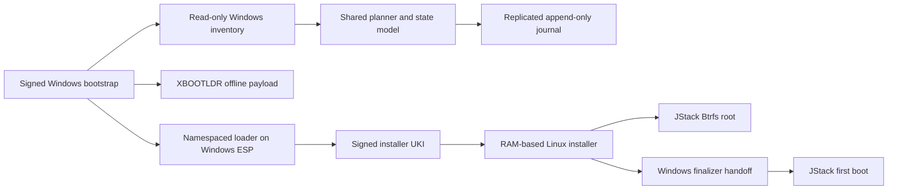

# No-USB installer architecture

## Product contract

The intended Windows experience is one signed command or application launch,
one UAC elevation, one exact disk-plan confirmation, and automatic reboot
handoffs. No USB drive and no network connection are required after the signed
payload is staged.

Partitioning is never fully silent. The user must see and approve the exact
disk, partition GUIDs, before/after sizes, and space allocation before the first
mutation.

## Components



### Windows bootstrap

- Collects an immutable hardware and storage inventory through the statically
  allowlisted read-only adapter described in
  [`WINDOWS_INVENTORY.md`](WINDOWS_INVENTORY.md).
- Rejects unsupported layouts rather than inferring destructive intent.
- Uses `Get-PartitionSupportedSize` and `Resize-Partition` for NTFS shrink.
- Downloads and verifies a signed release manifest and every content hash.
- Creates the planned XBOOTLDR partition in newly freed space.
- Copies the offline image, UKI, transition journal, and signed manifest.
- Places only install-instance-namespaced JStack loader files on the existing
  Windows ESP.
- Registers a Windows finalizer before the first reboot.
- Installs that finalizer as a boot-start dispatcher gated by signed handoff
  state, so an unexpected Windows resume enters recovery rather than finalizing.
- Arms a one-time UEFI boot entry and reboots.

The partition decision itself is delegated to the shared side-effect-free Rust
planner described in [`PLANNER.md`](PLANNER.md). Windows supplies supported
resize bounds and executes the returned exact plan; it does not recompute it.

### XBOOTLDR and payload

JStack uses one GPT XBOOTLDR partition on the Windows system disk. This avoids
placing large UKIs or OS images on the often-small Windows ESP. The existing
ESP receives only the signed loader needed for firmware entry. XBOOTLDR stays
after installation as the kernel, update, and recovery partition.

The offline system image is content-addressed and split into FAT32-compatible
chunks when necessary. The manifest binds chunk hashes, graph version, release
version, disk plan, and supported installer version.

### RAM installer

- Verifies the handoff and signed journal before using any disk identifier.
- Re-inventories the disk and requires the reconstructable Windows-handoff GPT
  fingerprint to match before creating root.
- Creates only partitions inside the confirmed unallocated interval.
- Deploys and verifies the JStack image without modifying Windows filesystems.
- Installs JStack boot artifacts on XBOOTLDR.
- Boots Windows once for finalization rather than declaring success early.

### Windows finalizer

- Confirms Windows still boots and the disk matches the committed plan.
- Restores BitLocker protection when it was suspended.
- Removes temporary bootstrap state while retaining recovery metadata.
- Arms JStack for one-time boot, then reboots.

### JStack first boot

- Verifies the installed root, boot entry, network stack, Niri session, and
  recovery timer.
- Records the success terminal only after those checks pass.

## State representation

The finite control state is only one part of the actual state space. Runtime
state is represented as:

```text
(control_state,
 graph_version,
 journal_sequence,
 release_manifest_hash,
 plan_hash,
 disk_guid,
 partition_fingerprint,
 confirmed_plan_hash,
 pending_transition,
 current_actor,
 boot_target,
 security_restore_status)
```

The JSON graph defines legal control transitions. Guards evaluate the signed
runtime context. A transition is committed only after its postconditions are
observed and an `action_committed` journal record is durable.

## Interruption semantics

For every mutating action:

1. Validate the source state and all guards.
2. Append and flush `action_intent` with transition ID and precondition hash.
3. Execute the action.
4. Observe postconditions independently.
5. Append and flush `action_committed`.
6. Advance the durable control state.

A transition may contain at most one mutating action. Operations that previously
looked atomic, such as partition creation plus formatting or multi-step rollback,
are separate named checkpoints. This makes partial progress observable instead
of collapsing it into an ambiguous compound transition.

After power loss, the runtime reads the pending intent:

- If preconditions still hold, retry the idempotent action.
- If postconditions hold, synthesize the missing commit record and advance.
- If neither holds, stop automatic mutation and enter rollback or manual
  recovery according to the graph.

## Primary references

The detailed platform boundary and evidence notes are in
[`PLATFORM_CONSTRAINTS.md`](PLATFORM_CONSTRAINTS.md).

- Microsoft `Resize-Partition`: <https://learn.microsoft.com/powershell/module/storage/resize-partition>
- Microsoft `Get-PartitionSupportedSize`: <https://learn.microsoft.com/powershell/module/storage/get-partitionsupportedsize>
- Microsoft `Suspend-BitLocker`: <https://learn.microsoft.com/powershell/module/bitlocker/suspend-bitlocker>
- Microsoft UEFI firmware variable API: <https://learn.microsoft.com/windows/win32/api/winbase/nf-winbase-setfirmwareenvironmentvariableexa>
- Microsoft UEFI/GPT partition guidance: <https://learn.microsoft.com/windows-hardware/manufacture/desktop/configure-uefigpt-based-hard-drive-partitions>
- Boot Loader Specification: <https://uapi-group.org/specifications/specs/boot_loader_specification/>
