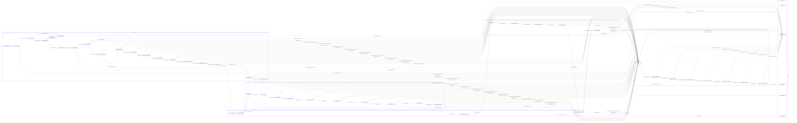

# Generated installer state graph

Generated from `installer/model/installer-state-graph.json`. Do not edit manually.

```mermaid
stateDiagram-v2
    direction LR
    [*] --> windows_bootstrap_started
    state "finalizer" as phase_finalizer {
        state "windows.bootstrap_cleaned" as windows_bootstrap_cleaned
        state "windows.jstack_rearm" as windows_jstack_rearm
        state "windows.jstack_rearm_armed" as windows_jstack_rearm_armed
        state "windows.finalizer_running" as windows_finalizer_running
        state "windows.security_restored" as windows_security_restored
        state "windows.jstack_boot_armed" as windows_jstack_boot_armed
    }
    state "first_boot" as phase_first_boot {
        state "jstack.first_boot" as jstack_first_boot
    }
    state "handoff" as phase_handoff {
        state "windows.reboot_to_installer_pending" as windows_reboot_to_installer_pending
        state "linux.reboot_to_windows_pending" as linux_reboot_to_windows_pending
        state "windows.reboot_to_jstack_pending" as windows_reboot_to_jstack_pending
    }
    state "linux" as phase_linux {
        state "linux.windows_finalizer_armed" as linux_windows_finalizer_armed
        state "linux.installer_booted" as linux_installer_booted
        state "linux.handoff_verified" as linux_handoff_verified
        state "linux.plan_revalidated" as linux_plan_revalidated
        state "linux.root_partition_ready" as linux_root_partition_ready
        state "linux.root_filesystem_ready" as linux_root_filesystem_ready
        state "linux.image_deployed" as linux_image_deployed
        state "linux.system_configured" as linux_system_configured
        state "linux.bootloader_ready" as linux_bootloader_ready
        state "linux.install_verified" as linux_install_verified
    }
    state "recovery" as phase_recovery {
        state "windows.rollback_boot_entries_removed" as windows_rollback_boot_entries_removed
        state "windows.rollback_esp_cleaned" as windows_rollback_esp_cleaned
        state "windows.rollback_partitions_deleted" as windows_rollback_partitions_deleted
        state "windows.rollback_ntfs_restored" as windows_rollback_ntfs_restored
        state "windows.rollback_security_restored" as windows_rollback_security_restored
        state "recovery.rollback_required" as recovery_rollback_required
        state "linux.rollback_to_windows_pending" as linux_rollback_to_windows_pending
        state "windows.rollback_running" as windows_rollback_running
    }
    state "terminal" as phase_terminal {
        state "terminal.unsupported" as terminal_unsupported
        state "terminal.cancelled" as terminal_cancelled
        state "terminal.completed" as terminal_completed
        state "terminal.rolled_back" as terminal_rolled_back
        state "terminal.manual_recovery" as terminal_manual_recovery
    }
    state "windows" as phase_windows {
        state "windows.bootstrap_started" as windows_bootstrap_started
        state "windows.preflight" as windows_preflight
        state "windows.bitlocker_finalizer_registered" as windows_bitlocker_finalizer_registered
        state "windows.xbootldr_partition_created" as windows_xbootldr_partition_created
        state "windows.installer_loader_files_staged" as windows_installer_loader_files_staged
        state "windows.installer_rearm_armed" as windows_installer_rearm_armed
        state "windows.plan_computed" as windows_plan_computed
        state "windows.payload_staging" as windows_payload_staging
        state "windows.payload_verified" as windows_payload_verified
        state "windows.payload_invalid" as windows_payload_invalid
        state "windows.awaiting_confirmation" as windows_awaiting_confirmation
        state "windows.plan_confirmed" as windows_plan_confirmed
        state "windows.bitlocker_prepared" as windows_bitlocker_prepared
        state "windows.space_reserved" as windows_space_reserved
        state "windows.xbootldr_ready" as windows_xbootldr_ready
        state "windows.payload_staged" as windows_payload_staged
        state "windows.installer_loader_staged" as windows_installer_loader_staged
        state "windows.bootnext_armed" as windows_bootnext_armed
        state "windows.installer_rearm" as windows_installer_rearm
    }
    windows_bootstrap_started --> windows_preflight: begin_preflight
    windows_preflight --> terminal_unsupported: reject_unsupported_platform
    windows_preflight --> windows_plan_computed: accept_preflight_and_plan
    windows_plan_computed --> windows_payload_staging: begin_payload_staging
    windows_plan_computed --> windows_payload_invalid: failure(begin_payload_staging)
    windows_payload_staging --> windows_payload_verified: accept_verified_payload
    windows_payload_staging --> windows_payload_invalid: failure(accept_verified_payload)
    windows_payload_staging --> windows_payload_invalid: mark_payload_invalid
    windows_payload_invalid --> windows_payload_staging: retry_payload_download
    windows_payload_invalid --> terminal_cancelled: cancel_invalid_payload
    windows_payload_verified --> windows_awaiting_confirmation: show_exact_plan
    windows_awaiting_confirmation --> terminal_cancelled: cancel_before_mutation
    windows_awaiting_confirmation --> windows_plan_confirmed: confirm_exact_plan
    windows_plan_confirmed --> windows_bitlocker_finalizer_registered: prepare_bitlocker
    windows_plan_confirmed --> recovery_rollback_required: failure(prepare_bitlocker)
    windows_bitlocker_finalizer_registered --> windows_bitlocker_prepared: suspend_bitlocker_after_finalizer
    windows_bitlocker_finalizer_registered --> recovery_rollback_required: failure(suspend_bitlocker_after_finalizer)
    windows_plan_confirmed --> windows_bitlocker_prepared: prepare_without_bitlocker
    windows_plan_confirmed --> recovery_rollback_required: failure(prepare_without_bitlocker)
    windows_bitlocker_prepared --> windows_space_reserved: reserve_windows_space
    windows_bitlocker_prepared --> recovery_rollback_required: failure(reserve_windows_space)
    windows_space_reserved --> windows_xbootldr_partition_created: create_xbootldr
    windows_space_reserved --> recovery_rollback_required: failure(create_xbootldr)
    windows_xbootldr_partition_created --> windows_xbootldr_ready: format_xbootldr
    windows_xbootldr_partition_created --> recovery_rollback_required: failure(format_xbootldr)
    windows_xbootldr_ready --> windows_payload_staged: copy_verified_payload
    windows_xbootldr_ready --> recovery_rollback_required: failure(copy_verified_payload)
    windows_payload_staged --> windows_installer_loader_files_staged: stage_installer_loader
    windows_payload_staged --> recovery_rollback_required: failure(stage_installer_loader)
    windows_installer_loader_files_staged --> windows_installer_loader_staged: create_installer_entry
    windows_installer_loader_files_staged --> recovery_rollback_required: failure(create_installer_entry)
    windows_installer_loader_staged --> windows_bootnext_armed: arm_installer_bootnext
    windows_installer_loader_staged --> recovery_rollback_required: failure(arm_installer_bootnext)
    windows_bootnext_armed --> windows_reboot_to_installer_pending: reboot_to_installer
    windows_bootnext_armed --> windows_installer_rearm: failure(reboot_to_installer)
    windows_reboot_to_installer_pending --> linux_installer_booted: installer_boot_observed
    windows_reboot_to_installer_pending --> windows_installer_rearm: windows_resumed_instead
    windows_installer_rearm --> windows_installer_rearm_armed: arm_installer_reboot_retry
    windows_installer_rearm --> recovery_rollback_required: failure(arm_installer_reboot_retry)
    windows_installer_rearm_armed --> windows_reboot_to_installer_pending: rearm_installer_boot
    windows_installer_rearm_armed --> recovery_rollback_required: failure(rearm_installer_boot)
    windows_installer_rearm --> recovery_rollback_required: exhaust_installer_rearm
    linux_installer_booted --> recovery_rollback_required: reject_invalid_linux_handoff
    linux_installer_booted --> linux_handoff_verified: verify_linux_handoff
    linux_handoff_verified --> linux_plan_revalidated: revalidate_linux_plan
    linux_handoff_verified --> recovery_rollback_required: reject_drifted_plan
    linux_plan_revalidated --> linux_root_partition_ready: create_linux_root
    linux_plan_revalidated --> recovery_rollback_required: failure(create_linux_root)
    linux_root_partition_ready --> linux_root_filesystem_ready: format_linux_root
    linux_root_partition_ready --> recovery_rollback_required: failure(format_linux_root)
    linux_root_filesystem_ready --> linux_image_deployed: deploy_jstack_image
    linux_root_filesystem_ready --> recovery_rollback_required: failure(deploy_jstack_image)
    linux_image_deployed --> linux_system_configured: configure_jstack_system
    linux_image_deployed --> recovery_rollback_required: failure(configure_jstack_system)
    linux_system_configured --> linux_bootloader_ready: install_jstack_boot
    linux_system_configured --> recovery_rollback_required: failure(install_jstack_boot)
    linux_bootloader_ready --> recovery_rollback_required: reject_invalid_offline_install
    linux_bootloader_ready --> linux_install_verified: verify_offline_install
    linux_install_verified --> linux_windows_finalizer_armed: arm_windows_finalizer
    linux_install_verified --> recovery_rollback_required: failure(arm_windows_finalizer)
    linux_windows_finalizer_armed --> linux_reboot_to_windows_pending: arm_windows_finalize
    linux_windows_finalizer_armed --> recovery_rollback_required: failure(arm_windows_finalize)
    linux_reboot_to_windows_pending --> recovery_rollback_required: reject_missing_windows_finalizer
    linux_reboot_to_windows_pending --> windows_finalizer_running: windows_finalizer_booted
    windows_finalizer_running --> windows_security_restored: restore_windows_security
    windows_finalizer_running --> terminal_manual_recovery: failure(restore_windows_security)
    windows_security_restored --> windows_bootstrap_cleaned: cleanup_windows_bootstrap
    windows_security_restored --> terminal_manual_recovery: failure(cleanup_windows_bootstrap)
    windows_bootstrap_cleaned --> windows_jstack_boot_armed: arm_installed_jstack
    windows_bootstrap_cleaned --> terminal_manual_recovery: failure(arm_installed_jstack)
    windows_jstack_boot_armed --> windows_reboot_to_jstack_pending: reboot_to_installed_jstack
    windows_jstack_boot_armed --> terminal_manual_recovery: failure(reboot_to_installed_jstack)
    windows_reboot_to_jstack_pending --> jstack_first_boot: jstack_boot_observed
    jstack_first_boot --> recovery_rollback_required: reject_failed_first_boot
    jstack_first_boot --> terminal_completed: complete_after_first_boot
    recovery_rollback_required --> windows_rollback_running: dispatch_rollback_windows
    recovery_rollback_required --> linux_rollback_to_windows_pending: dispatch_rollback_linux
    recovery_rollback_required --> terminal_manual_recovery: failure(dispatch_rollback_linux)
    linux_rollback_to_windows_pending --> windows_rollback_running: reboot_to_windows_rollback
    linux_rollback_to_windows_pending --> terminal_manual_recovery: failure(reboot_to_windows_rollback)
    windows_rollback_running --> windows_rollback_boot_entries_removed: execute_windows_rollback
    windows_rollback_running --> terminal_manual_recovery: failure(execute_windows_rollback)
    windows_rollback_boot_entries_removed --> windows_rollback_esp_cleaned: rollback_remove_esp_files
    windows_rollback_boot_entries_removed --> terminal_manual_recovery: failure(rollback_remove_esp_files)
    windows_rollback_esp_cleaned --> windows_rollback_partitions_deleted: rollback_delete_partitions
    windows_rollback_esp_cleaned --> terminal_manual_recovery: failure(rollback_delete_partitions)
    windows_rollback_partitions_deleted --> windows_rollback_ntfs_restored: rollback_expand_windows
    windows_rollback_partitions_deleted --> terminal_manual_recovery: failure(rollback_expand_windows)
    windows_rollback_ntfs_restored --> windows_rollback_security_restored: rollback_restore_security
    windows_rollback_ntfs_restored --> terminal_manual_recovery: failure(rollback_restore_security)
    windows_rollback_security_restored --> terminal_rolled_back: rollback_unregister_finalizer
    windows_rollback_security_restored --> terminal_manual_recovery: failure(rollback_unregister_finalizer)
    recovery_rollback_required --> terminal_manual_recovery: stop_on_rollback_divergence
    windows_bitlocker_prepared --> recovery_rollback_required: request_rollback_from_windows_bitlocker_prepared
    windows_space_reserved --> recovery_rollback_required: request_rollback_from_windows_space_reserved
    windows_xbootldr_ready --> recovery_rollback_required: request_rollback_from_windows_xbootldr_ready
    windows_payload_staged --> recovery_rollback_required: request_rollback_from_windows_payload_staged
    windows_installer_loader_staged --> recovery_rollback_required: request_rollback_from_windows_installer_loader_staged
    windows_bootnext_armed --> recovery_rollback_required: request_rollback_from_windows_bootnext_armed
    windows_installer_rearm --> recovery_rollback_required: request_rollback_from_windows_installer_rearm
    linux_installer_booted --> recovery_rollback_required: request_rollback_from_linux_installer_booted
    linux_handoff_verified --> recovery_rollback_required: request_rollback_from_linux_handoff_verified
    linux_plan_revalidated --> recovery_rollback_required: request_rollback_from_linux_plan_revalidated
    linux_root_partition_ready --> recovery_rollback_required: request_rollback_from_linux_root_partition_ready
    linux_root_filesystem_ready --> recovery_rollback_required: request_rollback_from_linux_root_filesystem_ready
    linux_image_deployed --> recovery_rollback_required: request_rollback_from_linux_image_deployed
    linux_system_configured --> recovery_rollback_required: request_rollback_from_linux_system_configured
    linux_bootloader_ready --> recovery_rollback_required: request_rollback_from_linux_bootloader_ready
    linux_install_verified --> recovery_rollback_required: request_rollback_from_linux_install_verified
    windows_bitlocker_finalizer_registered --> recovery_rollback_required: request_rollback_from_windows_bitlocker_finalizer_registered
    windows_xbootldr_partition_created --> recovery_rollback_required: request_rollback_from_windows_xbootldr_partition_created
    windows_installer_loader_files_staged --> recovery_rollback_required: request_rollback_from_windows_installer_loader_files_staged
    windows_installer_rearm_armed --> recovery_rollback_required: request_rollback_from_windows_installer_rearm_armed
    linux_windows_finalizer_armed --> recovery_rollback_required: request_rollback_from_linux_windows_finalizer_armed
    windows_reboot_to_jstack_pending --> windows_jstack_rearm: windows_resumed_instead_of_jstack
    windows_jstack_rearm --> windows_jstack_rearm_armed: arm_jstack_reboot_retry
    windows_jstack_rearm --> terminal_manual_recovery: failure(arm_jstack_reboot_retry)
    windows_jstack_rearm_armed --> windows_reboot_to_jstack_pending: reboot_rearmed_jstack
    windows_jstack_rearm_armed --> terminal_manual_recovery: failure(reboot_rearmed_jstack)
    windows_jstack_rearm --> recovery_rollback_required: exhaust_jstack_rearm
    windows_jstack_rearm --> recovery_rollback_required: request_rollback_from_windows_jstack_rearm
    windows_jstack_rearm_armed --> recovery_rollback_required: request_rollback_from_windows_jstack_rearm_armed
    terminal_unsupported --> [*]
    terminal_cancelled --> [*]
    terminal_completed --> [*]
    terminal_rolled_back --> [*]
    terminal_manual_recovery --> [*]
```
